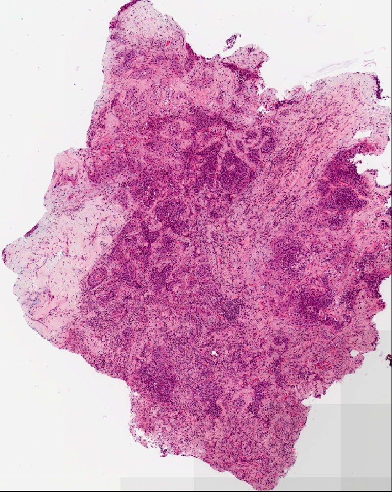
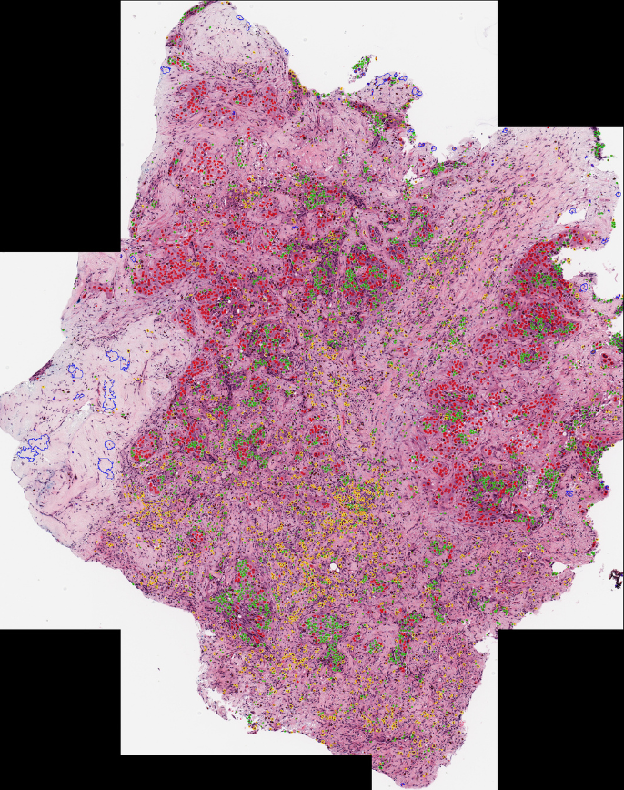

# Nuclear Profiling pipeline returning Spatial Nuclear Distribution in Whole Slide Images(WSIs) 

- Performs instance segmentation and classification of nuclei in Multi-Tissue Histology WSIs(generally 100k*100k pixels) to analyze intra-tumor heterogeneity by identifying cancerous subtypes.
- Scaled version of the publicly available HoVer-Net codebase. Utilizes
CLAM(Clustering-constrained Attention Multiple Instance Learning) codebase to identify diagnostically significant regions and return files with spatial data of each type of nuclei.
- Stores the nuclear spatial information(location coordinates, width, height) for each nuclear subtype in CSV files.
- Visualization.ipynb noebook visualizes the extracted data using various plots.

| Sample Input WSI Image  | Sample Output WSI image with different types of nuclei demarcated with different colors |
| ------------- | ------------- |
|   |   |
|  | Red: Epithelial; Yellow: Neutrophil; Green: Lymphocyte; Blue: Macrophage |

<!-- <p float="left">


</p> -->

## Creating Environment

```
conda env create -f environment.yml
conda activate WSINucleiInfo
pip install torch==1.6.0 torchvision==0.7.0
```

## Running the Code 
### Step 1 (making changes in run_tile_standard.sh file and modify type_info.json)

1. Mandatory changes to be made in run_wsi_standard.sh :  
    * nr_types=number_of_nuclei_types_to_predict     
    * model_mode=fast/original 
        * 'fast' mode must be selected for model checkpoints trained on PanNuke and MoNuSAC. 
        * 'original' must be selected for model checkpoints trained on CoNSeP
    * model_path=path_to_saved_model_checkpoints
    * input_file=

Further options in run_wsi_standard.sh :
```
  -h --help                   Show this string.
  --version                   Show version.

  --gpu=<id>                  GPU list. [default: 0]
  --type_info_path=<path>     Path to a json define mapping between type id, type name, 
                              and expected overlay color. 
  --nr_inference_workers=<n>  Number of workers during inference. [original value set in HoVer-Net repository : 8]
  --nr_post_proc_workers=<n>  Number of workers during post-processing. [original value set in HoVer-Net repository: 16]
  --batch_size=<n>            Batch size. [original value set in HoVer-Net repository: 128]
```
 
2. type_info.json is used to specify what RGB colours are used in the overlay. Make sure to modify this for different models. Therefore type_info.json file defining mapping between nuclear type id, nuclear type name, and expected nuclear overlay color.

### Step 2 (Obtaining Segmentation Coordinates)
```
cd ./patches_utils # Go to directory patches_utils
python create_patches_fp.py --source DATA_DIRECTORY --save_dir SEGMENTATION_DIR --patch_size 1024 --step_size 1024 --seg --patch --stitch
cd .. # Returning to the base HoVer-Net directory 
```

A sample output of the above command is stored in ./Output/Segmentation_Output/C3L-01663-21/

The above command performs the following functionalities :
* Recognizes the useful part(diagnostically significant regions) of the WSI by ignoring the redundant background surrounding the WSI
* Returns coordinates of tiles of size patch_size*path_size so that using them we can extract tiles from WSI to pass into the HoVer-Net function for nuclei segmentation and classification

Basic flags explanation :
* `--source` : path to folder containing raw wsi image files
* `--save_dir` : path to the directory that will store the output data(data with tiled coordinates to divide the WSI into small tiles and perform nuclear instance segmentation and classification on them).
* `--step_size` : step size (default = 256)
* `--patch_size` : patch size (default = 256)
* `--preset` : predefined profile of default segmentation and filter parameters (.csv). (default = None). 


**When passing patch_size, remember to pass in the value of step_size equal to patch_size to prevent overlapping of tiles**

### Model Weights 

These checkpoints were initially trained using TensorFlow and were converted using `convert_chkpt_tf2pytorch.py`. Provided checkpoints are trained for simultaneous segmentation and classification.

Segmentation and Classification:
- [CoNSeP checkpoint](https://drive.google.com/file/d/1FtoTDDnuZShZmQujjaFSLVJLD5sAh2_P/view?usp=sharing)
- [PanNuke checkpoint](https://drive.google.com/file/d/1SbSArI3KOOWHxRlxnjchO7_MbWzB4lNR/view?usp=sharing)
- [MoNuSAC checkpoint](https://drive.google.com/file/d/13qkxDqv7CUqxN-l5CpeFVmc24mDw6CeV/view?usp=sharing)

** These model weights have been accessed from [hovernet_repo_link](https://github.com/vqdang/hover_net) repository. If any of the above models are used, please ensure to cite the paper mentioned in the above stated repository.**


### Step 3 (HoVer-Net implementation)
```
python hovernet_wsi.py --hovernet_wsi_output OUTPUT_DIR --segmentation_output_dir SEGMENTATION_DIR --save_patch_overlay True
```
The above command performs the following functionalities :
* Returns a downsampled image(in png, tiff, jpg format) with demarcated regions of nuclei as well as classification of these nuclei depending upon the model selected by the user.
* Returns a single csv file containing width, height, centroid coordinates, contour coordinates, probability of a nuclei being of a given type for each nuclei instance.
* Returns a csv file for each nuclei type containing center coordinates, width, and height of all nuclei belonging to that particular nuclei class. Eg epithelial_df.csv, Macrophage_df.csv, etc.
* The following may also be returned (optional) : 
    * png images for each tile with demarcated and classified nuclei region. 
    * .mat files for each tile containing information about instances of nuclei present in that tile. This file could be further used for training. 
    * Output tiles in QuPath v0.2.3 compatible format.

Basic flags explanation :
* `--input_wsi_dir` : path to directory containing input wsi
* `--segmentation_output_dir` : path to the directory having segmentation output created by create_features_fp.py
* `--hovernet_wsi_output` : path to the directory which will store the output
* `--patch_size` : patch size (default = 1024)
* `--level` : level of wsi at which patches will be extracted for the hovernet code
* `--draw_grid` : If you want a grid on the overlay then enter True else False (default : False)
* `--save_patch_overlay` : If you want to save the overlay png image of each individual patch then enter True else False (default : False)
* `--save_mat` : If you want to save a .mat file for each individual patch containing nuclei information then enter True else False (default : True). These files can be helpful for generation of training data.

## Additional details about step 2

**Some parameter templates are availble and can be readily deployed. Some parameter templates are also availble and can be readily deployed as good choices for default parameters:**
* `bwh_biopsy.csv`: used for segmenting biopsy slides scanned at BWH (Scanned using Hamamatsu S210 and Aperio GT450) 
* `bwh_resection.csv`: used for segmenting resection slides scanned at BWH
* `tcga.csv`: used for segmenting TCGA slides

Simply pass the name of the template file to the --preset argument, for example, to use the biopsy template:
```
python create_patches_fp.py --source DATA_DIRECTORY --save_dir SEGMENTATION_DIR --patch_size 1024 --step_size 1024 --seg --patch --stitch --preset bwh_biopsy.csv
```

Additional flags that can be passed include:
* `--custom_downsample`: factor for custom downscale (not recommended, ideally should first check if native downsamples exist)
* `--patch_level`: which downsample pyramid level to extract patches from (default is 0, the highest available resolution)
* `--no_auto_skip`: by default, the script will skip over files for which patched .h5 files already exist in the desination folder, this toggle can be used to override this behavior

**To set custom segmentation parameters like seg_level, sthresh, mthresh, use_otsu, close, etc kindly refer [clam_repo_link](https://github.com/mahmoodlab/CLAM) where setting cutom parameters for segmentation has been explained in detail**


The command of step 2 will segment every wsi in DATA_DIRECTORY using default parameters, extract all patches within the segemnted tissue regions, create a stitched reconstruction for each slide using its extracted patches (optional) and generate the following folder structure at the specified segmentation_output_dir:

```bash
segmentation_output_dir/
	├── masks
    		├── wsi_1.png
    		├── wsi_2.png
    		└── ...
	├── patches
    		├── wsi_1.h5
    		├── wsi_2.h5
    		└── ...
	├── stitches
    		├── wsi_1.png
    		├── wsi_1.png
    		└── ...
	└── process_list_autogen.csv
```

The masks folder contains the segmentation results (one image per slide). The patches folder contains arrays of extracted tissue patches from each slide (one .h5 file per slide, where each entry corresponds to the coordinates of the top-left corner of a patch) The stitches folder contains downsampled visualizations of stitched tissue patches (one image per slide) (Optional, not used for downstream tasks) The auto-generated csv file process_list_autogen.csv contains a list of all slides processed, along with their segmentation/patching parameters used.

## Output

**The link to the Output folder: [Output_Folder_Link](https://drive.google.com/drive/folders/1idQoOWAeYXjmzooFi1-rDNNb5EcAtlKg?usp=sharing)**

Structure of the output folder containing csv, mat, tsv, and json files with spatial nuclear information of each type of nuclei class and png, jpg, and tif files with segmented output images:
```bash
Output/
    ├── Segmentation_Output
            ├── InputWSIName(Eg. C3L-01663-21)
                    ├── (This output directory is explained in the previous )
	├── wsi_output
    		├── InputWSIName(Eg. C3L-01663-21)
            |
            ├── InputWSIName_overlayed.jpg (Eg. C3L-01663-21_overlayed.jpg, jpg segmentated wsi image)
            |
            ├── InputWSIName_overlayed.png (Eg. C3L-01663-21_overlayed.png, png segmentated wsi image)
            |
            ├── InputWSIName_overlayed.tif (Eg. C3L-01663-21_overlayed.tif, tif segmentated wsi image)
            |
            ├── mat 
                 ├── patch_0.mat
                 ├── patch_1.mat
                 ├── ...    
            ├── qupath
                 ├── patch_0.tsv
                 ├── patch_1.tsv
                 ├── ...  
            ├── json 
                 ├── patch_0.json
                 ├── patch_1.json
                 ├── ...                        
            ├── overlay
                 ├── patch_0.png
                 ├── patch_1.png
                 ├── ... 
            └── wsi_info
                 ├── InputWSIName_json.json
                 ├── nuclei_type1_df.csv (Eg. Lymphocyte_df.csv)
                 ├── nuclei_type2_df.csv (Eg. Neutrophil_df.csv) 
                 ├── nuclei_type3_df.csv (Eg. epithelial_df.csv)     
                 ├── nuclei_type4_df.csv (Eg. Macrophage_df.csv)
                 ├── ...
                 └── patch_coordinates.csv

```
* mat: contains matlab files with nuclear spatial information for each tile(patch of size patch_size*patch_size). These files could be used for training the nuclear instance segmentation and classification models. To avoid storing these files, pass the save_mat flag in hovernet_wsi.py as False in hovernet_wsi.py

* overlay: contains overlay of nuclear boundaries on top of original RGB tiles for each tile(patch of size patch_size*patch_size). To avoid storing these files, pass the save_patch_overlay flag in hovernet_wsi.py as False in hovernet_wsi.py

* json: contains the information of the (centroid coordinates, contour coordinates, nuclei type, nuclei type probability) for each detected nuclei in a tile for each tile.

* wsi_info: 
    * InputWSIName_json.json: Eg. C3L-01663-21_json.json, contains the information of the (centroid coordinates, contour coordinates, nuclei type, nuclei type probability) for each detected nuclei in the WSI.
    * nuclei_type1_df.csv: Eg. Lymphocyte_df.csv, would contain the centroid coordinates, height, and width of all detected nucleui of type1(eg. Lymphocyte) in the WSI.
    * patch_coordinates.csv: contains the bounding box coordinates of each tile of the WSI. 

## Visualizing Output
The files mentioned below are present in the Visualization folder.

* See nuclei distribution and spatial data visualization by pannuke pretrained model: Visualization_pannuke.ipynb

* See nuclei distribution and spatial data visualization by MoNuSac pretrained model: Visualization_MoNuSac.ipynb

* wsi_file_path and dataframes_path are required to be passed in the 3rd and 4th cell of the ipynb notebook. After doing so the cells of the notebook can be executed to show inference visualization.
    * wsi_file_path : Path to the original wsi file in svs format.
    * dataframes_path : Path to the wsi_info folder created as an output for a particular wsi containing csv and json files


